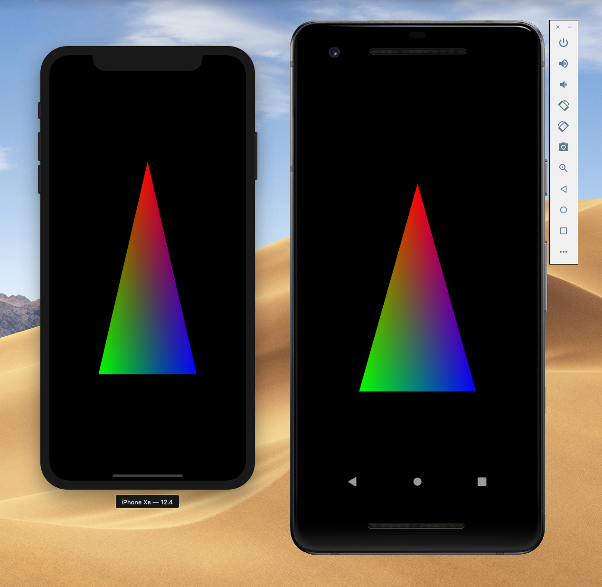
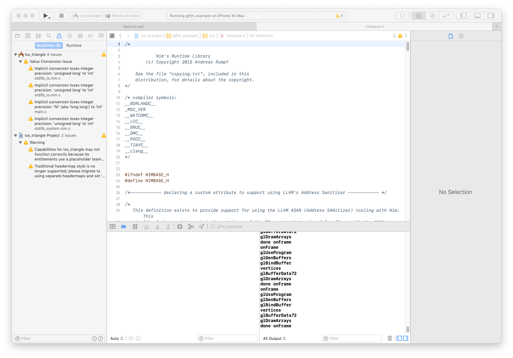
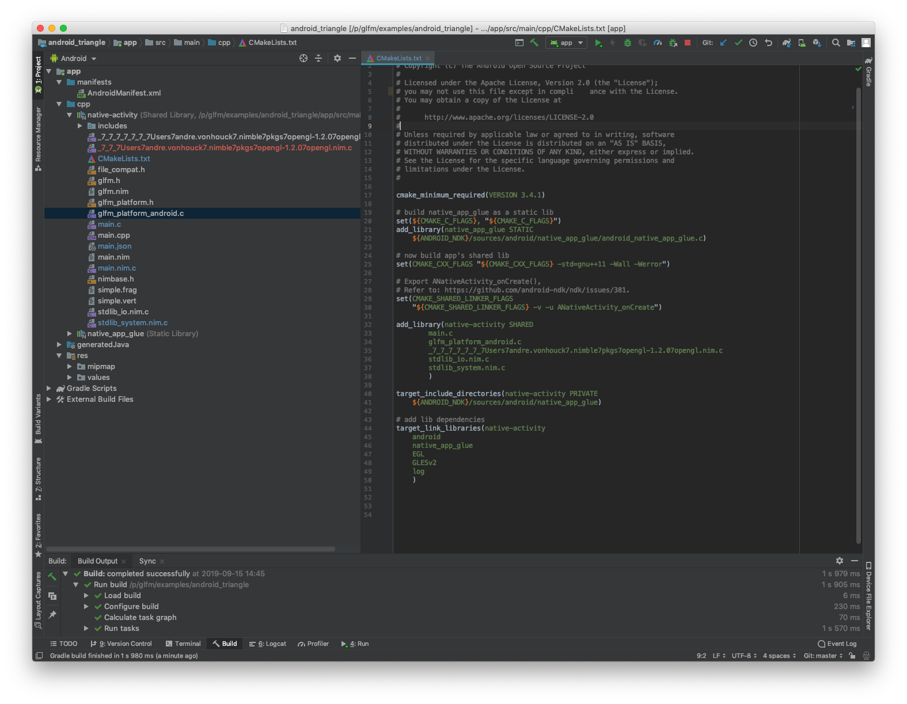

# glfm

Wrapper of GLFM (OpenGL ES and input for iOS and Android) library for Nim.

Its very simple and is very simmilar to the GLFW wrapper for desktop apps.
Together with GLFW + GLFM you can writes app for almost any platform.



# Compiling for iOS:

Tested with:
  * MacOS Majave Version 10.14.6
  * XCode Version 10.3 (10G8)
  * Nim Compiler Version 0.20.99 [MacOSX: amd64]

```cp examples```

Compile everything for iOS:

```nim c -c --os:android main.nim```

(Yes saying android when compilng for iOS is very odd but its as close to mobile as you get)

Now copy the generated C files into the iOS project folder

```cp ~/.cache/nim/main_d/* ios_triangle/example/src/; cp ios_triangle/example/src/main.nim.c ios_triangle/example/src/main.c```

Then you go to XCode and hit compile:



# Compiling for Android

Tested with:
  * MacOS Majave Version 10.14.6
  * XCode Version 10.3 (10G8)
  * Android Studio 3.4.2
  * Nim Compiler Version 0.20.99 [MacOSX: amd64]

Go to the examples folder

```cp examples```

Compile everything for android running arm processor:

```nim c -c --cpu:arm --os:android main.nim```

Now copy the generated C files into the Android project folder

```cp ~/.cache/nim/main_d/* android_triangle/app/src/main/cpp/; cp android_triangle/app/src/main/cpp/main.nim.c android_triangle/app/src/main/cpp/main.c```

Then you go to android studio and hit compile:


